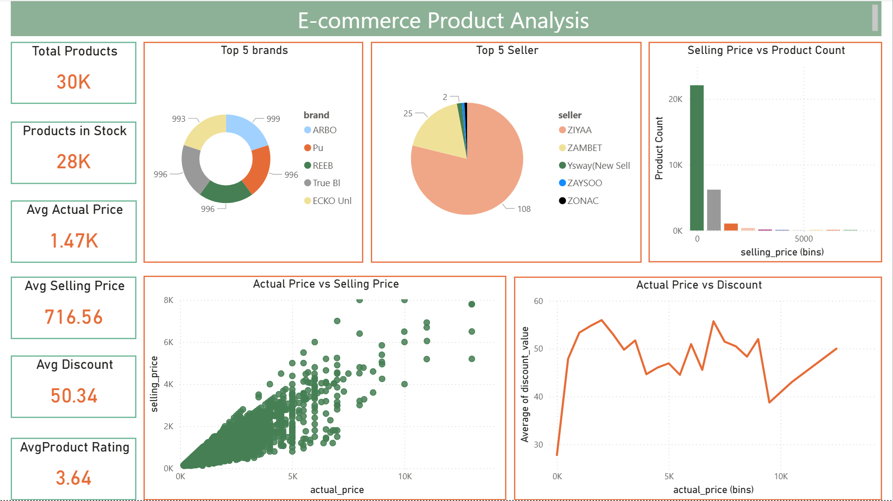

# E-commerce_Product_Analysis

## Project Overview
This project analyzes product pricing and trends in the e-commerce domain using machine learning. It follows the complete data science workflow from data cleaning and exploratory analysis to model training, evaluation, and deployment.

A **Flask app** allows users to interactively explore product data and predictions, while a **Power BI dashboard** provides key insights and visualizations.

---

## Features
- **Data Cleaning:** Handling missing values, duplicates, and inconsistent entries.  
- **Exploratory Data Analysis (EDA):** Visualizations and correlation analysis to understand product trends and pricing patterns.  
- **Feature Engineering & Scaling:** Preparing numerical and categorical features for machine learning models.  
- **Model Training:** Predicting product prices or trends using Linear Regression, Support Vector Machine, and K-Nearest Neighbor and GridSearchCV for tuning.  
- **Evaluation:** Metrics including **RMSE, MAE, R²**, and performance visualization.  
- **Interactive App:** **Flask-based web app** for exploring product data and predictions.  
- **Dashboard:** Visual summaries of product trends, sales, and pricing patterns.

---

## Development Environment
- **Tools:** Jupyter Notebook, VS Code  
- **Packages:** pandas, numpy, scikit-learn, matplotlib, seaborn, Flask  

---

## Running the Flask App
```bash
python app.py
```

- Enter product details in the input form.
- Get predicted selling price of the product.

---

## Key Learnings

- Data cleaning and preprocessing for real-world e-commerce datasets
- Feature importance and trend analysis using machine learning models
- Predicting product prices and identifying pricing patterns
- Deploying ML models using Flask for interactive web applications
- End-to-end workflow from raw data to actionable business insights

---

## Power BI Dashboard

### Page 1: E-commerce Product Analysis


**Insights Covered:**
- Overview of product performance and inventory  
- Pricing analysis including actual vs selling prices and discounts  
- Brand and seller distribution  
- Key trends and patterns to support business decisions
